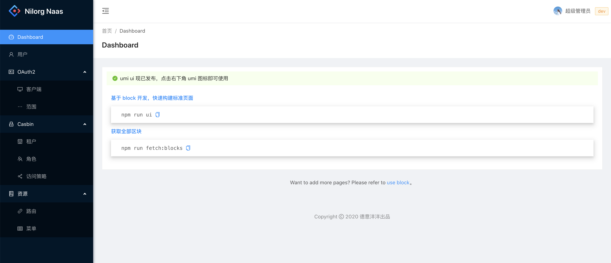

# naas-web

迁移代码，来自 crontab-web

# 设计菜单原型



# 使用 Docker 部署

### 1. 下载代码

```bash
git clone https://github.com/nilorg/naas-web.git
```

### 2. 修改 OAuth2 配置

修改文件`src/utils/constants.ts`中的配置信息

`OAUTH2_SERVER`naas 的域名

`OAUTH2_CLIENT_ID`naas 服务器中的 naas-web 客户端 ID（默认 1000）

`OAUTH2_CALLBACK`naas-web 授权完毕后的回调地址（修改为 naas-web 访问地址）

### 3. 修改 Nginx 配置

修改文件`config/nginx-default.conf`中的 Nginx 配置信息，改为 naas 服务器中的实际地址

### 4. 编译 Docker 镜像

```bash
./scripts/build-docker.sh
```

### 5. 运行 Docker

```bash
docker run -p 8800:80 -d --name nilorg-naas-web nilorg/naas-web:latest
```

# telepresence

```bash
# 覆盖
telepresence --namespace nilorg --swap-deployment naas-web --expose 8000 \
--run yarn start:dev --port=8000
# 创建新的
telepresence --namespace nilorg --new-deployment naas-web --expose 8000 \
--run yarn start:dev --port=8000
```

```bash
kubectl delete -n nilorg deployment naas-web
kubectl delete -n nilorg service naas-web
```
