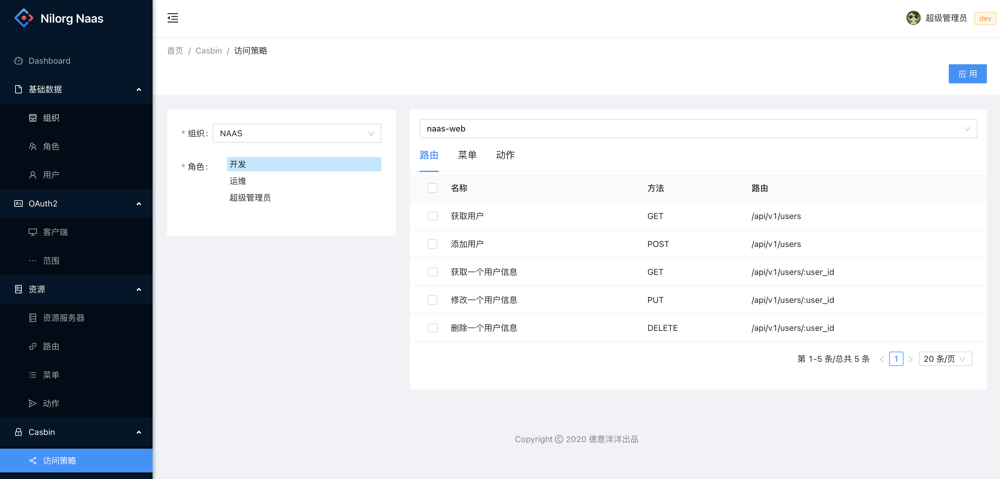

# naas-web

迁移代码，来自 crontab-web

# 设计菜单原型



# telepresence

```bash
# 覆盖
telepresence --namespace nilorg --swap-deployment naas-web --expose 8000 \
--run yarn start:dev --port=8000
# 创建新的
telepresence --namespace nilorg --new-deployment naas-web --expose 8000 \
--run yarn start:dev --port=8000
```

```bash
kubectl delete -n nilorg deployment naas-web
kubectl delete -n nilorg service naas-web
```
